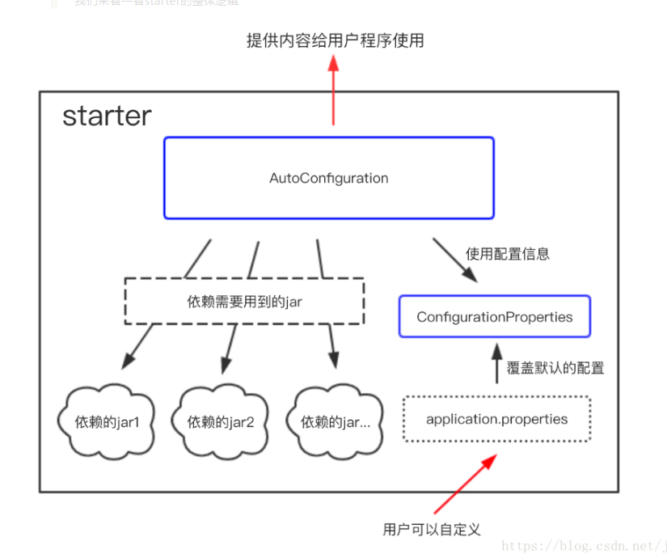
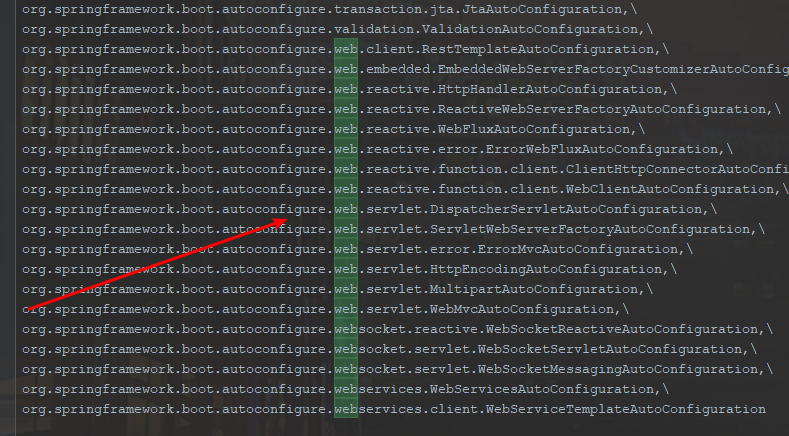

# 基于SpringCloud Alibaba的Project


- [QuickStart](#QuickStart)
- [版本](#版本：)

- [知识点](#知识点:)


### QuickStart

#### 	1.前往nacos官网下载nacos （本人1.0.3）

- [下载链接](https://github.com/alibaba/nacos/releases)

-  [Nacos文档](https://nacos.io/zh-cn/docs/quick-start.html)

  

#### 	2.导入工程（maven）

##### 				执行  `mvn clean install`


#### 	3.其他 


<hr>
### 版本：

###### **2019.10.16

> 版本：**1.0.2**
>
> 作者：**lomo fu**
>
> 内容：整合Fegin 取代Rest Template
>
> ​			整合Sentinel和Sentinel Dashboard


###### **2019.10.15**

> 版本：**1.0.1**
>
> 作者：**lomo fu**
>
> 内容：整合了README.md SpringBoot知识点


###### **2019.10.15**

> 版本：**1.0**
>
> 作者：**lomo fu**
>
> 内容：整合了user-center 和content-center SpringBoot应用 
>
> ​			整合了RestTemplate
>
> ​			整合了Nacos服务发现
>
> ​			整合ribboo实现随机负载均衡，根据nacos权重负载均衡，根据集群负载均衡


<hr>

### 																												Category


### 知识点:

​	[一.关于SpringBoot本身](#一.关于SpringBoot本身)

​			[springboot 开发基于三步:](#1.springboot 开发基于三步:)

​					[1.依赖](#1.依赖)

​					[2.注解](2.注解)

​					[3.配置](#3.配置)

​			[springboot监控:](#2.springboot监控)


[Feign常见问题](http://www.imooc.com/article/289005)


<hr>

##### 		springboot 开发基于三步:一.关于SpringBoot本身


###### 1.springboot 开发基于三步:


##### 1.依赖

###### 	Spring Boot中的Starter介绍:

​		*启动器是一套方便的依赖没描述符*

​		*SpringBoot已经默认将这些场景配置好了，只需要在配置文件中指定少量的配置就可以了运行起来*

##### 	Starter原理介绍:

*首先是启动类*

###### 1.==@SpringBootApplication==注解组成: 通过@SpringBootApplication注解标注此类为springboot启动类

###### 						==@SpringBootConfiguration==**:Spring Boot的配置类,表示是一个配置类(**@Configuration**)

###### 						==@EnableAutoConfiguration==：开启自动配置功能


> ###### ==@EnableAutoConfiguration组成：开启自动配置功能==
>
> ###### @AutoConfigurationPackage:
>
> ###### 	自动配置包,将主配置类（@SpringBootApplication标注的类）的所在包及下面所有子包里面的所有组件扫描到Spring容器。(相当于原来开启包扫描);
>
> ###### @Import(EnableAutoConfigurationImportSelector.class):
>
> ###### 	Spring Boot在启动的时候从`spring-boot-autoconfigure-2.1.9.RELEASE.jar`包路径下的`META-INF/spring.factories`中获取EnableAutoConfiguration指定的值，将这些值作为自动配置类导入到容器中，自动配置类就生效，帮我们进行自动配置工作；以前我们需要自己配置的东西，自动配置类都帮我们(例如SpringMVC中的视图解析器之类的);


> 将configuration类中定义的bean加入spring到容器中**。**就相当于加载之前我们自己配置组件的xml文件。而现在SpringBoot自己定义了一个默认的值，然后直接加载进入了Spring容器。


```java
@Override
//传入参数注解的元数据
public String[] selectImports(AnnotationMetadata annotationMetadata) {   
    //如果注解元数据不可得
    if (!isEnabled(annotationMetadata)) {      
        return NO_IMPORTS;   
    }
    //根据当前bean的ClassLoader加载自动配置元数据
    AutoConfigurationMetadata autoConfigurationMetadata = AutoConfigurationMetadataLoader         .loadMetadata(this.beanClassLoader);
    //通过自动配置元数据得到配置实例
    AutoConfigurationEntry autoConfigurationEntry = 								          getAutoConfigurationEntry(autoConfigurationMetadata,annotationMetadata); 
     // 返回最终得到的自动化配置类
    return StringUtils.toStringArray(autoConfigurationEntry.getConfigurations());
}


protected AutoConfigurationEntry getAutoConfigurationEntry(AutoConfigurationMetadata autoConfigurationMetadata,
			AnnotationMetadata annotationMetadata) {
		if (!isEnabled(annotationMetadata)) {
			return EMPTY_ENTRY;
		}
    	 // 获取注解的属性
		AnnotationAttributes attributes = getAttributes(annotationMetadata);
     	// 读取spring.factories属性文件中的数据
		List<String> configurations = getCandidateConfigurations(annotationMetadata, attributes);
    	// 删除重复的配置类
		configurations = removeDuplicates(configurations);
        // 找到@EnableAutoConfiguration注解中定义的需要被过滤的配置类
		Set<String> exclusions = getExclusions(annotationMetadata, attributes);
		checkExcludedClasses(configurations, exclusions);
     	// 删除这些需要被过滤的配置类
		configurations.removeAll(exclusions);
		configurations = filter(configurations, autoConfigurationMetadata);
		fireAutoConfigurationImportEvents(configurations, exclusions);
		return new AutoConfigurationEntry(configurations, exclusions);
	}


protected List<String> getCandidateConfigurations(AnnotationMetadata metadata, AnnotationAttributes attributes) {
    // 调用SpringFactoriesLoader的loadFactoryNames静态方法
  	// getSpringFactoriesLoaderFactoryClass方法返回的是EnableAutoConfiguration类对象
		List<String> configurations = SpringFactoriesLoader.loadFactoryNames(getSpringFactoriesLoaderFactoryClass(),
				getBeanClassLoader());
		Assert.notEmpty(configurations, "No auto configuration classes found in META-INF/spring.factories. If you "
				+ "are using a custom packaging, make sure that file is correct.");
		return configurations;
	}


```

> Spring Framework内部使用一种**工厂加载机制(Factory Loading Mechanism)**。这种机制使用SpringFactoriesLoader完成，SpringFactoriesLoader使用loadFactories方法加载并实例化从META-INF目录里的spring.factories文件出来的工厂，这些spring.factories文件都是从classpath里的jar包里找出来的。


##### starter 总体流程:



*扩展 自定义启动类: https://segmentfault.com/a/1190000011433487#articleHeader5*


##### demo:

```xml
<!--这里以spring-boot-starter-web会引入spring-webmvc等模块的依赖，引入自己所需要的依赖-->
<dependency>    
	<groupId>org.springframework.boot</groupId>    
	<artifactId>spring-boot-starter-web</artifactId>
</dependency>	
```



##### 2.注解

​	[SpringBoot 注解大全](https://blog.csdn.net/weixin_40753536/article/details/81285046)


> #### 常见问题

​	1.@Resource 和 @AutoWire区别?

|              |                          @Resource                           |                          @Autowire                           |
| ------------ | :----------------------------------------------------------: | :----------------------------------------------------------: |
| 注解来源     |                             JDK                              |                            Spring                            |
| 装配方式     |                          优先按名称                          |                          优先按类型                          |
| 属性         |                                                              |                                                              |
| 组合(ByName) |                   @Resource(name ="name")                    |             @Autowired()<br />@Qualifier("name")             |
| 总结         | 推荐使用：@Resource注解在字段上，这样就不用写setter方法了，并且这个注解是属于J2EE的，减少了与spring的耦合。这样代码看起就比较优雅。 | 推荐使用：@Resource注解在字段上，这样就不用写setter方法了，并且这个注解是属于J2EE的，减少了与spring的耦合。这样代码看起就比较优雅。 |


​	 2.Spring @Component，@ Service，@ Repository，@ Controller差异?

|    注解名    |                     作用                     |
| :----------: | :------------------------------------------: |
|  @Component  | 最普通的组件，可以被注入到spring容器进行管理 |
| @ Repository |                 作用于持久层                 |
|  @ Service   |               作用于业务逻辑层               |
| @ Controller |       作用于表现层（spring-mvc的注解）       |


3.Spring Boot 核心几个注解

|     注解名     |                             作用                             |
| :------------: | :----------------------------------------------------------: |
| @Configuration | 用来代替 applicationContext.xml 配置文件，所有这个配置文件里面能做到的事情都可以通过这个注解所在类来进行注册 |
|     @Bean      |        用来代替 XML 配置文件里面的 <bean ...> 配置。         |
|    @Import     | 用来引入额外的一个或者多个 @Configuration 修饰的配置文件类。 |
| @ComponentScan | 用来代替配置文件中的 component-scan 配置，开启组件扫描，即自动扫描包路径下的 @Component 注解进行注册 bean 实例到 context 中。 |


##### 3.配置

> 1. ##### 读取配置文件


##### @Value( “ ${ 属性名 } ” )

1.application.yml

```yaml
spring:
  profiles:
    active: qa
server:
  port: 8080
---
spring:
  profiles: dev

server:
  port: 8081
my:
  id: ${random.int}
  name : lomo-dev
---
spring:
  profiles: qa

server:
  port: 8088
my:
  id: ${random.int}
  name: lomo-qa
```

2.java:

```java
@Data
@Component
@Scope(scopeName = "prototype")
public class My {

    @Value("${my.id}")
    private Integer id;
    @Value("${my.name}")
    private String name;


}

@RestController
public class Controller {

    @Resource
    private My my;

    @GetMapping("test")
    public HashMap<String, Object> get(){
        HashMap<String, Object> hashMap = new HashMap<>();
        hashMap.put("id", my.getId());
        hashMap.put("name", my.getName());
        return hashMap;
    }

}
```


------


##### **@ConfigurationProperties(prefix = "keyName")**

1.application.yml

```
spring:
  profiles:
    active: qa
server:
  port: 8080
---
spring:
  profiles: dev

server:
  port: 8081
my:
  name: forezp
  age: 12
  number:  ${random.int}
  uuid : ${random.uuid}
  max: ${random.int(10)}
  value: ${random.value}
  greeting: hi,i'm  ${my.name}
---
spring:
  profiles: qa

server:
  port: 8088
my:
  name: forezp
  age: 12
  number:  ${random.int}
  uuid : ${random.uuid}
  max: ${random.int(10)}
  value: ${random.value}
  greeting: hi,i'm  ${my.name}


```

${random} ，它可以用来生成各种不同类型的随机值。


2.java:

```java
@Data
@Component
@ConfigurationProperties(prefix = "my")
public class My {
    private String name;
    private int age;
    private int number;
    private String uuid;
    private int max;
    private String value;
    private String greeting;
}

```

3.另外需要在应用类或者application类，加`@EnableConfigurationProperties`注解。

```java
@SpringBootApplication
@EnableConfigurationProperties
public class DemoApplication {    
	public static void main(String[] args) {
    			SpringApplication.run(DemoApplication.class, args);    
			}
	}
```

##### @**PropertySource(value = "classpath:自定义配置.properties")**

1.test.properties

```yml
my.name=forezp
my.age=12
```

2.java:

```java
@Data
@Configuration
@PropertySource(value = "classpath:test.properties")
@ConfigurationProperties(prefix = "my")
public class My {
    private String name;
    private int age;
    private int number;
    private String uuid;
    private int max;
    private String value;
    private String greeting;
}


@RestController
public class Controller {

    @Resource
    private My my;

    @GetMapping("test")
    public HashMap<String, Object> get(){
        HashMap<String, Object> hashMap = new HashMap<>();
        hashMap.put("age", my.getAge());
        hashMap.put("name", my.getName());
        return hashMap;
    }

}
```

3.需要在应用类或者application类,`@EnableConfigurationProperties({ User.class })`

```java
@SpringBootApplication
@EnableConfigurationProperties({My.class})
public class DemoApplication {    
				public static void main(String[] args) { 							                             SpringApplication.run(DemoApplication.class, args);
					}
				}
```


> 2. 多环境配置

*. properties

>  在现实的开发环境中，我们需要不同的配置环境；格式为application-{profile}.properties，其中{profile}对应你的环境标识，比如：
>
> - application-test.properties：测试环境
> - application-dev.properties：开发环境
> - application-prod.properties：生产环境


*. yml

```yml
#指定运行时环境
spring:
  profiles:
    active: qa
server:
  port: 8080
---
#DEV
spring:
  profiles: dev

server:
  port: 8081
my:
  name: forezp
  age: 12
  number:  ${random.int}
  uuid : ${random.uuid}
  max: ${random.int(10)}
  value: ${random.value}
  greeting: hi,i'm  ${my.name}
---
#QA
spring:
  profiles: qa

server:
  port: 8088


```

 参考:	[读取配置文件](https://www.cnblogs.com/jtlgb/p/8532280.html)    [配置多环境](https://www.jianshu.com/p/f24b312db08b)


###### 2.springboot监控

​		

​		Actuator 监控: